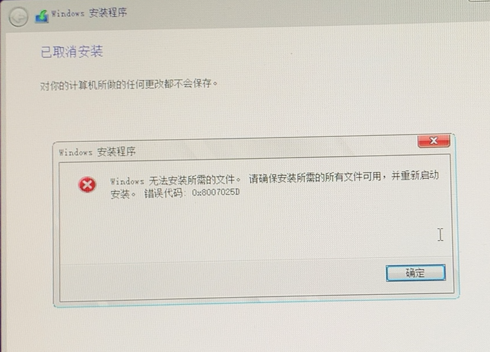

# 问题：安装时提示无法安装所需文件。请确保安装所需的文件可用，并重新启动安装。错误代码：0x8007025D

## 解决问题的经历

    在我有一天要重装一个笔记本电脑的Win10系统的时候，我像之前一样在官网下载了win10的镜像文件，然后放到u盘里面然后进行安装的时候出现了这个，我以为我下载的镜像损坏了，因为我这个u盘好多好多年前的了，我也不知道坏了没，然后我检测了一下u盘，发现没问题，之后我重新下载了一下镜像，发现问题还是没有解决，于是我排除了这个问题。我于是网络上查找，发现有的人说安装镜像的时候u盘格式会变，变成了fat32格式。于是我看了一下果然是，之后我把镜像放到了另一个电脑上，格式化了一下u盘，将格式变成了NTFS格式，然后再试还是不行，于是我又陷入了沉思，然后重置bios。不行，之后我又网上查询发现还能格式化磁盘，我恍然大悟，然后我在想我怎么没想到哈哈哈，然后我选中磁盘然后点删除，然后再新建分区，它如果你全删了之后再新建会自动创建一个系统分区和主分区，然后你选到主分区安装系统就正常了（别选到系统分区，空间那么小你能安装才怪了）

 ## 解决方法：
    方法1、
    安装系统的时候删除所有分区，然后再新建分区，这时会自动创建一个系统分区，一个主分区，将系统安装到主分区里面，然后问题解决（本人尝试成功）

    方法2、
    重置bios，再尝试方法1（本人尝试成功）
    注意：记得将第一启动项再设置为u盘启动。。。

    方法3、
    用第三方PE安装（没试过，应该有用，网络查询说有用）

    方法4、
    u盘分区格式用NTFS，不要用Fat32（本人试过，但没用，但是无路可走的你可以再试一遍）

    方法5、
    换个u盘（说不定是你u盘坏了，但是你没发现？？）

    方法6、
    内存条拿出来擦一下，或者换一个，如果有两个，拿出来一个，你可以都试一下（台式机好弄，笔记本可能难一些，没试过，但你还能试试，软件层面都不行再进行硬件排除，你也不知道它本来好好的，你一打开，它一生气就坏了。。。）

    方法6、
    售后，或者花钱找个人帮你装

    方法7、
    有其他方法我在补...

 ## 小声嘀咕
    其实我搞好这个问题之后发现又进来重装的界面我以为没弄好，又格式化了重装了一遍，写这个文章的时候才发现，它弄好重启又进了u盘。。。
